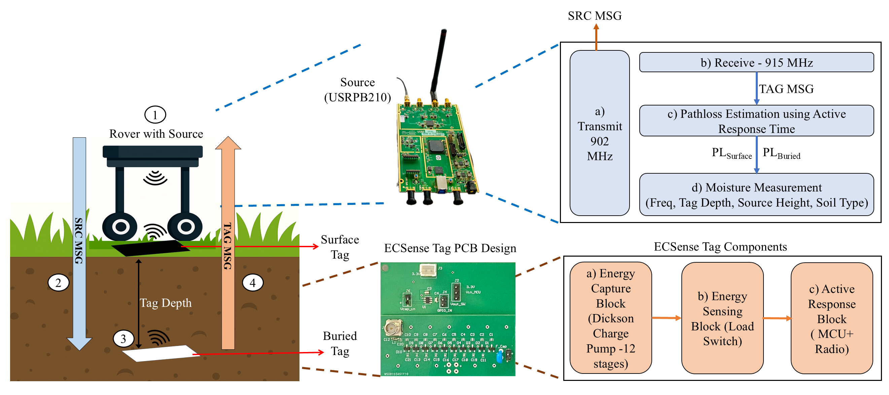

# EC-Sense: Radio Energy Capture for Wireless Soil Moisture Sensing

<b>Abstract</b> : Understanding the spatial and temporal variations in soil moisture is critical for sustainable agriculture. Contactless
approaches such as ground penetrating radar, and satellite are either expensive or offer limited resolution, making them
less scalable. In-situ sensors, while offering high resolution, often involve challenging data retrieval processes. In this
work, we propose EC-Sense, a wire-free system for in-situ soil moisture sensing that employs ultra-low-power sensor
Tags buried underground and reference Tags placed on the surface. EC-Sense introduces a novel sensing modality
based on the energy capture time (EC Time). We define EC Time as the time taken by a sensor Tag to harvest sufficient
energy to activate a response; EC Time serves as a proxy for path loss in soil, which is a clear indicator of soil moisture.
Our approach of using differential path loss, estimated from the EC Times of both surface and buried Tags, isolates
soil-induced pathloss from that of the environment above ground. By decoupling sensing from communication, EC-Sense
overcomes the challenges present in existing RF-based soil sensors that rely on wide-band sensing. Despite using an
active radio, we estimate an impressive battery life of over 16 years for the sensor Tags. We deployed EC-Sense in an
open agriculture field and measured soil moisture at multiple depths over multiple days. We show experimentally that
EC-Sense can measure moisture at depths of 40cm with 98% accuracy compared to ground truth

The figure below shows the EC-Sense framework :

## Hardware and Software
* Sotware codes for Source can be found in [Source](Source/) folder.
* The PCB design of Tag can be found in [Tag Hardware](Tag/Hardware_Design) folder.
* Software codes for Tag can be found in [Tag Software](Tag/Software_Codes) folder.

